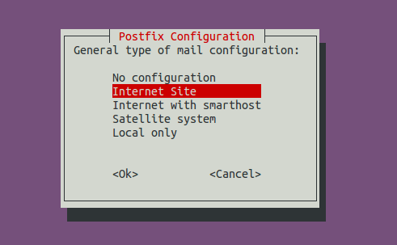
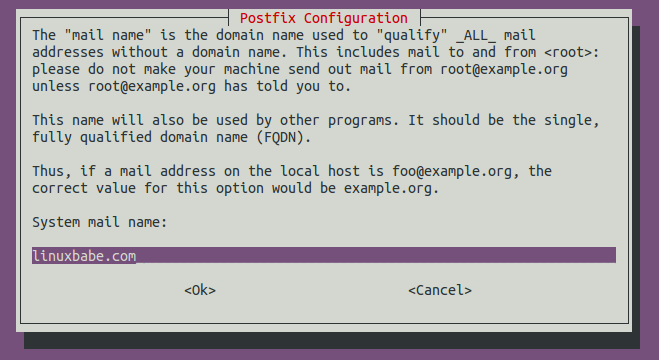
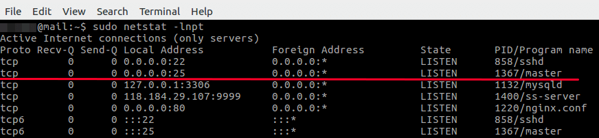
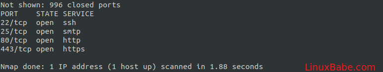
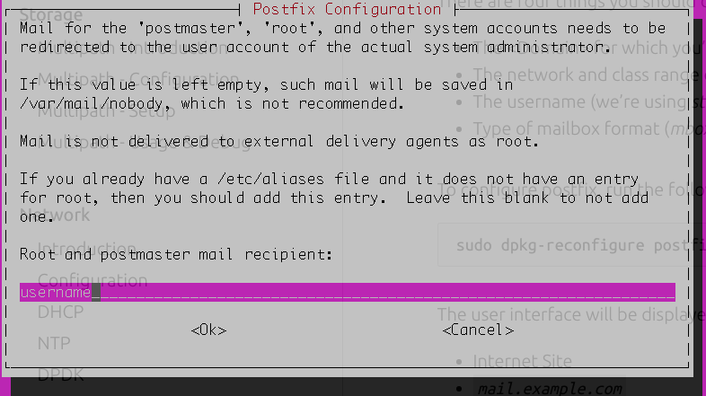
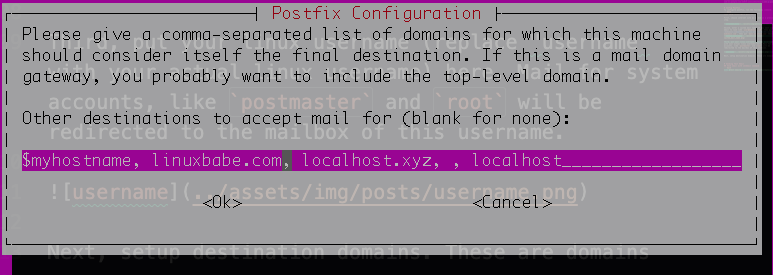

# How To Setup Postfix, Postfix w/TLS and DKIM
References:

1. [Installing Postfix](https://www.linuxbabe.com/mail-server/setup-basic-postfix-mail-sever-ubuntu)
2. [Postfix](https://ubuntu.com/server/docs/mail-postfix)

# Install Postfix
[(Main Reference)](https://www.linuxbabe.com/mail-server/setup-basic-postfix-mail-sever-ubuntu)

On the ubuntu server, run:
```bash
sudo apt-get update

sudo apt-get install postfix -y
```
You will be asked to select a type for mail configuration. Choose `Internet Site`.


* `No configuration` means the installation process will not configure any parameters.
* `Internet Site` means using Postfix for sending emails to other MTAs and receiving email from other MTAs.
* `Internet with smarthost` means using postfix to receive email from other MTAs, but using another smart host to relay emails to the recipient.
* `Satellite system` means using smart host for sending and receiving email.
* `Local only` means emails are transmitted only between local user accounts.

Next, enter your domain name for the system mail name, i.e. the domain name you want to display after the `@` symbol. For example, I want my email to be `alex@mydomain.com`, so I should put `mydomain.com` here. This domain name will be appended to addresses that doesn’t have a domain name specified.


Once installed, Postfix will be automatically started and a `/etc/postfix/main.cf` file will be generated. Now we can check Postfix version with this command:
```bash
postconf mail_version
```
The `netstat` utility tells us that the Postfix master process is listening on TCP port 25.
```bash
sudo netstat -lnpt
```


Postfix ships with many binaries under the `/usr/sbin/` directory, as can be seen with the following command.
```bash
dpkg -L postfix | grep /usr/sbin/
```
Output:
```bash
/usr/sbin/rmail
/usr/sbin/sendmail
/usr/sbin/posttls-finger
/usr/sbin/smtp-sink
/usr/sbin/postfix-add-filter
/usr/sbin/postdrop
/usr/sbin/postconf
/usr/sbin/postsuper
/usr/sbin/qshape
/usr/sbin/postfix-add-policy
/usr/sbin/postkick
/usr/sbin/smtp-source
/usr/sbin/postfix
/usr/sbin/postmulti
/usr/sbin/qmqp-source
/usr/sbin/postlock
/usr/sbin/postqueue
/usr/sbin/postlog
/usr/sbin/postalias
/usr/sbin/postmap
/usr/sbin/qmqp-sink
/usr/sbin/postcat
```
# Port 25 Connectivity
## Enable Inbound Traffic for Port 25
Ubuntu doesn’t enable a firewall by default. If you have enabled the UFW firewall, you need to open port 25 (inbound) with the following command, so Postfix can receive emails from other SMTP servers.
```bash
sudo ufw allow 25/tcp
```
## Port 25 Inbound Connectivity
Install nmap
```
sudo apt install nmap
```
Then use `nmap` to scan open ports on our server. Run the following command. Replace your-server-ip with actual IP.
```
sudo nmap 207.246.110.31
```


## Port 25 Outbound Connectivity
Run the following command on your mail server to check if port 25 (outbound) is blocked.
```bash
telnet gmail-smtp-in.l.google.com 25
```
If it’s not blocked, you would see messages like below, which indicates a connection is successfully established. (Hint: Type in quit and press Enter to close the connection.)
```bash
Trying 74.125.68.26...
Connected to gmail-smtp-in.l.google.com.
Escape character is '^]'.
220 mx.google.com ESMTP y22si1641751pll.208 - gsmtp
```

# Config Postfix
To configure postfix, run the following command:
```bash
sudo dpkg-reconfigure postfix
```
First, choose internet site as we did in a previous step.


Second, enter a system mail name. If you want your email to look like `user@mydomain.com`, then put `mydomain.com` there. If you want it to be `user@mail.mydomain.com`, then put `mail.mydomain.com` there.


Third, put your linux username (replace "username" with your actual linux username) here. Mail for system accounts, like `postmaster` and `root` will be redirected to the mailbox of this username.



Next, setup destination domains. These are domains for which your machine will consider itself as the final destination (aka it will keep the email locally). Normally, you want to make sure that the system mail name you setup in the second step is in destination domains.



For the following screens, on each screen, use the default setting, which should look like:
```
No
127.0.0.0/8 [::ffff:127.0.0.0]/104 [::1]/128
0
+
all
```

To manually configure postfix, use the command `sudo vim /etc/postfix/main.cf`. You could also use `postconf` to configure postfix. For example:

To configure the mailbox format for Maildir:
```
sudo postconf -e 'home_mailbox = Maildir/'
```
This will place new mail in `/home/username/Maildir`.
# Sending Test Email
Run the following command:
```bash
echo "test email" | sendmail your-account@gmail.com
```
If you fail to send the email, you should check the log file at `/var/log/mail.log` to see what went wrong.

# Setup TLS with Postfix

# Setup DKIM with Postfix